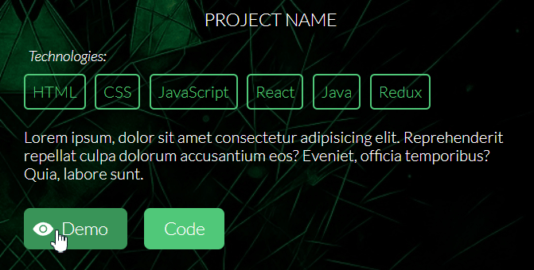

# Seth Ferreira | Front-End Developer Portfolio

This portfolio website was built to showcase my development work in a professional and organized way. Its main purpose is to provide potential employers and collaborators with an easy way to view my projects, skills, and background, while demonstrating my ability to build responsive, modern web interfaces.

I created this project to strengthen my front-end development skills and improve my understanding of responsive design, layout structure, and UI/UX principles. Throughout the process, I learned how to optimize layouts for different screen sizes, refine navigation usability, and write cleaner, more maintainable CSS.

Key features include:

- Fully responsive layout
- Project showcase with technology highlights
- Skills section with visual icons for technologies
- Openable resume in PDF format
- Contact form for inquiries

- Modern styling and clean visual design

## How to View
Open `index.html` in your browser to explore the portfolio.

## Technologies & Tools

### Core Technologies
- HTML5
- CSS3

### Supporting Tools / Utilities
- [Normalize.css](https://necolas.github.io/normalize.css/) – for cross-browser consistency
- [Google Fonts](https://fonts.google.com/) – for typography
- [Ionicons](https://ionicons.com/) – for icons
